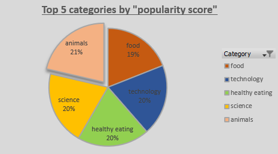
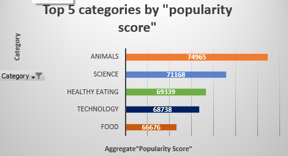
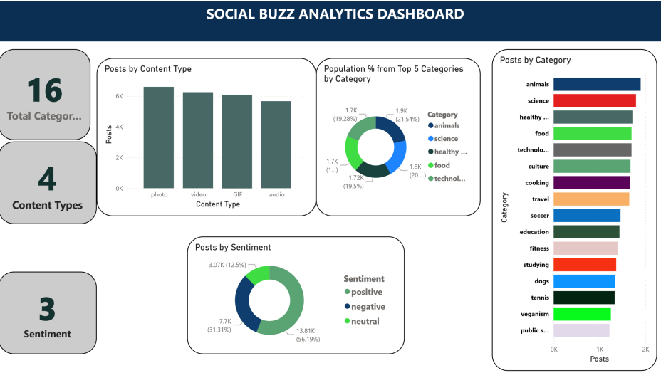

# Problem Statement
Social Buzz, a social media platform has expanded its operations to a global scale, generating over 100,000 posts in a day. With so much content, they'd like an analysis of the  performing content to  understand customer behaviour based on preferences and insights that will drive marketing strategies and improve sales. 
## Project overview
This project aims to provide insights into the content performance. By Analyzing various aspects of the content data, we seek to gain deeper understanding of their content performances, identify the most popular content categories among users,  provide actionable insights and make-data driven recommendations.
## Dataset
The dataset used in this project is from Forage and contains three tables:

-`Content `Table: Contains fields like `ContentID`,  `UserID`,`Content Categories`, and `URL`.

-`Reactions` Table: Contains  fields like `ContentID`, `Reaction_Types`, `Reaction_Scores`, and `Date`.

-`ReactionTypes`Table: Maps `Reaction_Types` to `Reaction Scores`.

DIsclaimer. This is not a real life dataset.
## Tool(s)
Excel(data cleaning, validation,modelling, aggregation & visualization.
### Data Validation & Cleaning
-Ensuring Consistency in Data Types: I validated that each column contained only a single datatype, ensuring uniformity and accuracy across the dataset.

-I used the filter icon to identify blank spaces and inconsistencies in rows. I deleted the null values from the datasets.

-Removing Unnecessary Characters: I used the "Replace" function to eliminate unwanted characters, such as quotation marks, that could interfere with the analysis.

-Dropping Irrelevant Columns: I identified and removed columns that were not essential for the analysis, such as the UserID column, to enhance focus and reduce noise.

-Renaming Columns for Clarity: To improve the dataset’s readability and interpretability.

-Renamed `Categories` and `types` in the Content Table to `Content Categories` and `Content type`.

-Renamed `Scores` in the `Reaction Type` Table to `Reaction Scores`.

-Renamed `type` from `Reactions` Table to` Reaction Types`.
### Data modelling
After cleaning the datasets, I modeled the data by linking the three tables (`Content` table, `Reactions` table, and `ReactionTypes` table) using Excel VLOOKUP. This step consolidated the data into a single table for analysis and visualization.
### Purpose of Each Table
Content Table: Contains `ContentID`, Content Categories, and Content Type.
Reactions Table: Stores reactions with fields like ContentID, Reaction_Types, Reaction_Scores, and Date.
ReactionTypes Table: Maps Reaction_Types to Reaction Scores.
### Linking the Tables
Understanding Relationships
The `Reaction_Types` field is a primary key in the `ReactionTypes` Table but a foreign key in the `Reactions` Table.
The `ContentID` field is a primary key in the `Content` Table and a foreign key in the `Reactions` Table
### Creating a Merged Table
To prepare a fact table for analysis, I needed the following fields in one sheet:

`ContentID`,`Content Categories`,`Content Type`,`Reaction_Types`,,`Reaction Scores`,`Date`
I followed these steps:

Add Blank Columns: In the Reactions Table, I created blank columns for `Content Categories`, `Content Type`, and `Reaction Scores`.
Use VLOOKUP: I used the VLOOKUP function to populate these new columns by fetching data from the Content Table and ReactionTypes Table.
Example VLOOKUP function: =VLOOKUP(A2,Content!A1:C1001,3,FALSE)
### Data aggregation and Visualization: Data Visualization:
I created  visualizations using Pivot Tables and Pivot Charts, ensuring the charts were readable and used colour encoding to highlight the highest-performing values for clarity and emphasis. I also created KPIs to show the month with the highest reaction, content category with most reaction, and unique content categories.

, , , .png)

